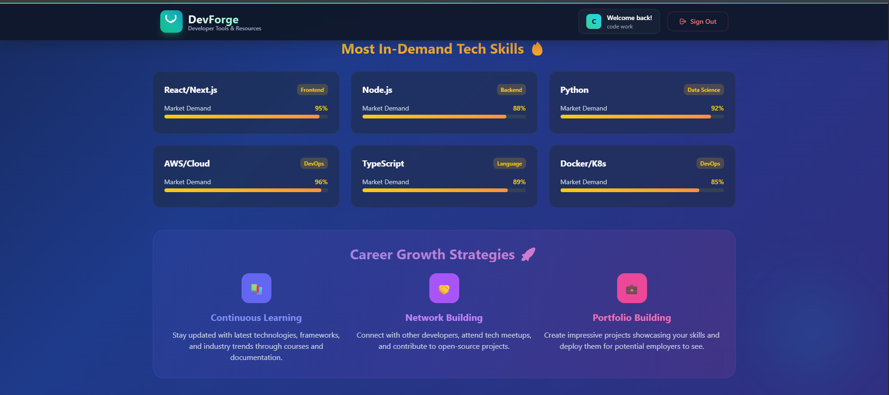
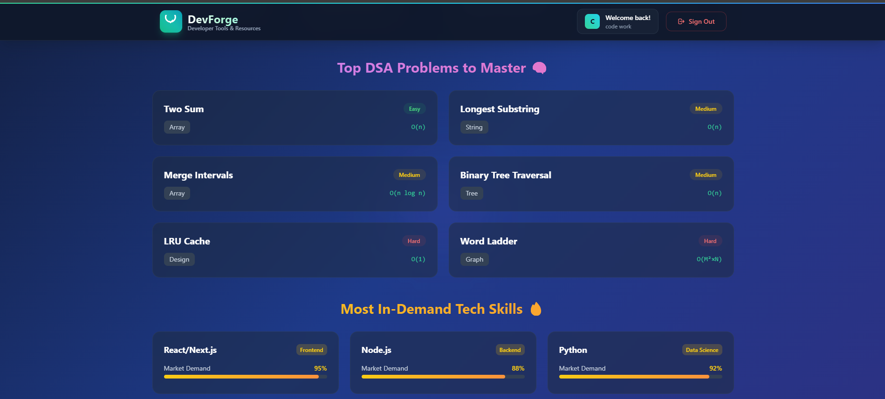
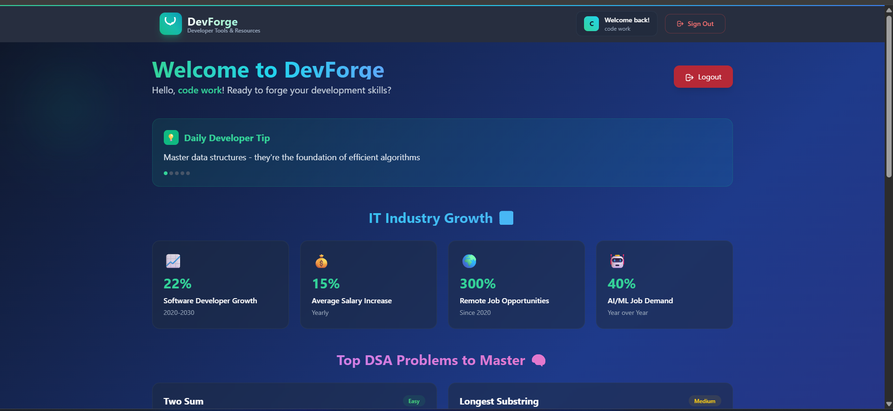
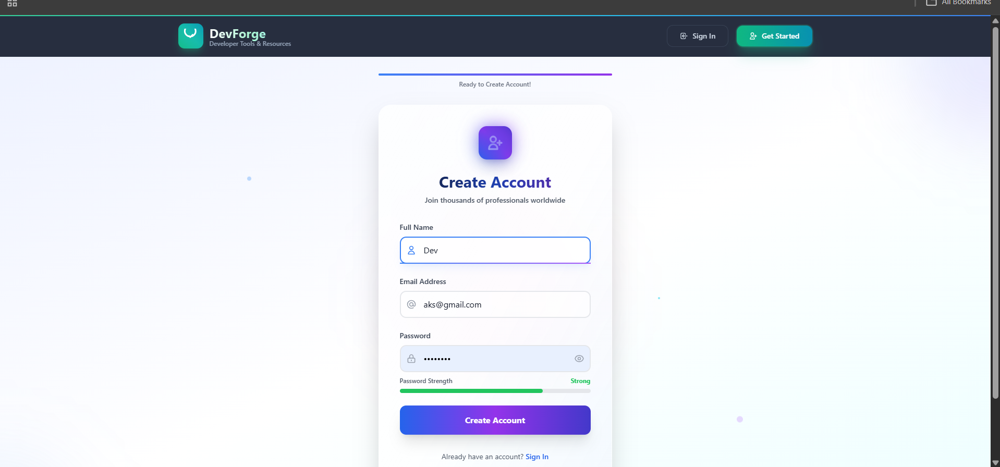
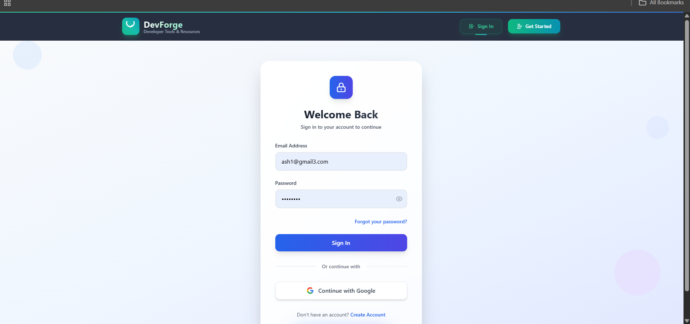

# Devforge: Secure MERN Stack Application with Firebase Authentication

<p align="center">
  
  
  
  
  
</p>

---

Welcome to the **Devforge** project! This repository provides a robust foundation for building modern web applications, combining the power of the MERN stack (MongoDB, Express.js, React, Node.js) with the simplicity and security of Firebase Authentication.


---

## 🌟 Project Overview

This is a full-stack web application designed for secure user authentication and management. It leverages a powerful combination of technologies to deliver a smooth and responsive user experience.

* **Frontend**: Built with **React.js** using **Vite** for a lightning-fast development experience. Styling is handled by **Tailwind CSS**, and user authentication state is efficiently managed with React's **Context API**.
* **Backend**: Powered by **Node.js** and **Express.js**, it interacts with **MongoDB** (via Mongoose) for data storage. Firebase Admin SDK is integrated to securely verify user identities.
* **Authentication**: Secure and reliable user authentication is provided by **Firebase Authentication**, supporting various methods (e.g., email/password, Google Sign-In).

---

## 📁 Folder Structure Explained

Understanding the project's layout is crucial. Here's a clear breakdown of where everything lives:

```
Devforge/
│
├── backend/
│   ├── index.js             # The heart of the backend: Express server, MongoDB connection, Firebase Admin setup.
│   ├── routes/
│   │   └── users.js         # Defines all API endpoints related to user operations (e.g., registration, login, profile).
│   ├── models/
│   │   └── User.js          # Mongoose schema for the User model, defining how user data is structured in MongoDB.
│   ├── .env                 # Backend environment variables (e.g., MongoDB connection URI, path to Firebase credentials).
│   └── fir-auth-...json     # Your Firebase Admin SDK service account key (JSON file) - **CRITICALLY IMPORTANT: This MUST be gitignored!**
│
├── frontend/
│   ├── src/
│   │   ├── App.jsx
│   │   ├── main.jsx
│   │   ├── index.css        # The main CSS file, where Tailwind CSS directives are imported.
│   │   ├── firebase/
│   │   │   └── firebase.js  # Client-side Firebase configuration and initialization (uses frontend .env variables).
│   │   ├── context/
│   │   │   └── AuthContext.jsx # React Context for global authentication state management.
│   │   └── pages/
│   │       └── Home.jsx     # The main dashboard page, showcasing user information, tips, stats, and more.
│   ├── .env                 # Frontend environment variables (prefixed with VITE_ for Vite compatibility).
│   ├── tailwind.config.js   # Configuration file for Tailwind CSS.
│   ├── postcss.config.js    # PostCSS configuration, typically used by Tailwind CSS.
│   └── vite.config.js       # Vite build tool configuration, including how it loads environment variables.
│
└── README.md                # You're reading it! Project documentation.
```

---

## ⚙️ How the Backend Works

The backend acts as the secure bridge between your frontend and your database, handling all sensitive operations like user data storage and authentication verification.

* **Express.js Server**: The `index.js` file sets up the Express server, establishes a connection to your MongoDB database using Mongoose, and initializes the Firebase Admin SDK.
* **Environment Configuration**: It loads crucial environment variables from the `.env` file, including your MongoDB connection URI and the path to your Firebase Admin SDK service account JSON file.
* **Firebase Admin SDK**: This powerful SDK allows the backend to securely interact with Firebase services. Its primary role here is to **verify Firebase ID tokens** sent from the frontend, ensuring that requests come from authenticated and legitimate users.
* **User API Routes**: The `routes/users.js` file defines API endpoints for common user actions. When the frontend needs to register a new user or retrieve user-specific data, it communicates with these routes.
* **MongoDB Integration**: User data (beyond what Firebase provides) is stored in MongoDB, managed by the Mongoose `User` schema defined in `models/User.js`.

**In Simple Terms:**

When you perform an action on the frontend that requires server interaction (like accessing a protected resource), your React app sends a request to the backend. This request includes your **Firebase ID token**. The backend then takes this token, sends it to Google's Firebase servers for verification using the Firebase Admin SDK. If the token is valid, the backend knows you're a real, authenticated user and proceeds to handle your request, interacting with MongoDB if necessary.

---

## ⚙️ How the Frontend Works

The frontend provides the user interface and handles user interactions, seamlessly integrating with Firebase Authentication and the backend API.

* **React App with Vite**: The application is a single-page React application, bootstrapped with Vite for an incredibly fast development server and optimized builds.
* **Tailwind CSS for Styling**: All styling is handled with Tailwind CSS, a utility-first CSS framework that allows for rapid UI development directly in your JSX. Its configuration is in `tailwind.config.js`, and the core directives are imported in `src/index.css`.
* **Firebase JS SDK**: The `src/firebase/firebase.js` file initializes the client-side Firebase SDK. This is what enables features like user sign-up, login, and managing user sessions directly in the browser. Crucially, it uses environment variables (prefixed with `VITE_`) from its own `.env` file to configure Firebase.
* **AuthContext for State Management**: The `src/context/AuthContext.jsx` file implements a React Context. This is a powerful pattern that makes the user's authentication state (e.g., `isLoggedIn`, `currentUser` object) available to any component in the application without prop-drilling.
* **Dashboard (`Home.jsx`)**: This is the main landing page after a user logs in. It's a rich dashboard that showcases various dynamic contents:
    * A personalized welcome message with user information.
    * Rotating daily developer tips.
    * Interesting IT industry statistics.
    * Insights into top DSA (Data Structures and Algorithms) problems.
    * Guidance on in-demand tech skills.
    * Strategies for career growth.
    * A user-friendly logout modal.

**In Simple Terms:**

When you open the app, the frontend is ready for action. If you're not logged in, you'll see options to sign up or log in via Firebase. Once you successfully authenticate with Firebase (e.g., using your Google account), Firebase sends back an ID token. The `AuthContext` captures this information and makes it available throughout your app. This allows protected pages (like the dashboard) to know you're logged in and display personalized content. When the frontend needs more data, it smartly includes your Firebase ID token in requests to the backend, which then verifies your identity.

---

## 🛠️ Environment Variables Setup

Both the frontend and backend require specific environment variables to function correctly. These variables store sensitive information (like API keys and database credentials) that shouldn't be hardcoded or committed to version control.

**Before you start, rename `backend/.env.example` to `backend/.env` and `frontend/.env.example` to `frontend/.env` (if they exist, otherwise create them).**

### Backend (`backend/.env`)

Create a file named `.env` in your `backend/` directory and populate it with your specific values:

```env
# MongoDB Connection URI (replace with your MongoDB Atlas or local URI)
MONGODB_URI=your-mongodb-connection-string

# Port for the Express.js server to run on
PORT=5000

# Path to your Firebase Admin SDK service account JSON file
# IMPORTANT: This file MUST be placed in your backend directory and gitignored!
FIREBASE_ADMIN_CREDENTIALS_PATH=./fir-auth-mern-stack-firebase-adminsdk-xxxxx-xxxxxx.json
```

### Frontend (`frontend/.env`)

Create a file named `.env` in your `frontend/` directory and populate it with your Firebase client-side configuration. **Remember, Vite requires frontend environment variables to be prefixed with `VITE_`.**

To get these values:

1.  Go to your Firebase project in the Firebase Console.
2.  Click on "Project settings" (the gear icon).
3.  Scroll down to the "Your apps" section and select your web app.
4.  You'll find your "Firebase SDK snippet" under "Config". Copy those values.

```env
# Your Firebase Web App Configuration (from Firebase Console)
VITE_REACT_APP_API_KEY=your_firebase_api_key
VITE_REACT_APP_AUTH_DOMAIN=your_firebase_auth_domain
VITE_REACT_APP_PROJECT_ID=your_firebase_project_id
VITE_REACT_APP_STORAGE_BUCKET=your_firebase_storage_bucket
VITE_REACT_APP_MESSAGING_SENDER_ID=your_firebase_Messaginger_id
VITE_REACT_APP_APP_ID=your_firebase_app_id
```

-----

## 🚀 How to Run This Project

Let's get this application humming on your local machine!

### 1. Backend Setup

Navigate to the `backend/` directory in your terminal:

```bash
cd backend
```

**Install Dependencies:**

```bash
npm install
```

**Set up Firebase Admin SDK Service Account:**

1.  Go to your Firebase project in the Firebase Console.
2.  Navigate to **Project settings** > **Service accounts**.
3.  Click on "Generate new private key" and then "Generate key". This will download a JSON file.
4.  Place this downloaded JSON file (e.g., `fir-auth-mern-stack-firebase-adminsdk-xxxxx-xxxxxx.json`) into your `backend/` directory.
5.  Update the `FIREBASE_ADMIN_CREDENTIALS_PATH` in your `backend/.env` file to correctly point to this file's path (e.g., `./fir-auth-mern-stack-firebase-adminsdk-xxxxx-xxxxxx.json`).

**Start the Backend Server:**

```bash
npm start
# or simply
node index.js
```

You should see messages indicating that the server is running and connected to MongoDB (e.g., "Server running on port 5000", "MongoDB Connected...").

### 2. Frontend Setup

Open a **new terminal window** and navigate to the `frontend/` directory:

```bash
cd ../frontend
```

**Install Dependencies:**

```bash
npm install
```

**Set up Frontend `.env`:**
Make sure you've populated your `frontend/.env` file with the Firebase client configuration as described in the [Environment Variables Setup](#-environment-variables-setup) section.

**Start the Frontend Development Server:**

```bash
npm run dev
```

Vite will start the development server. You'll usually see a message like "Local: http://localhost:5173/". Open this URL in your browser to see the application!

-----

## 🔒 Security Notes - Read Carefully!

Security is paramount. Please pay close attention to these critical points:

  * **NEVER Commit Secrets**: Under no circumstances should you commit your `backend/.env` file, `frontend/.env` file, or your Firebase Admin SDK service account JSON file (`fir-auth-...json`) to your Git repository. These files contain sensitive credentials!

  * **`.gitignore` is Your Friend**: Ensure your `.gitignore` file (at the root of your project) includes entries for these files. A typical `.gitignore` for this project should include:

    ```gitignore
    # Environment variables
    .env
    .env.local
    .env.*.local

    # Firebase Admin SDK credentials
    *.json # Be careful with this - if you have other JSON files, list the specific service account file.
    # Example for specific file:
    fir-auth-mern-stack-firebase-adminsdk-*.json
    ```

  * **Client vs. Server Secrets**: Remember that environment variables prefixed with `VITE_` in the frontend are eventually exposed in the client-side JavaScript bundle. While necessary for Firebase's client SDK, **never place truly sensitive, non-Firebase-client-related API keys or secrets directly in your frontend `.env` files.** Always route those through your backend server for secure handling.

-----

## 📝 Summary

This project provides a robust, well-structured starting point for a MERN stack application, featuring:

  * **Modern Authentication**: Secure user management powered by Firebase Authentication.
  * **Frontend Excellence**: A fast, responsive, and maintainable UI built with React, Vite, and Tailwind CSS. React Context API ensures seamless authentication state management.
  * **Solid Backend**: A Node.js/Express.js backend with MongoDB integration and Firebase Admin SDK for secure token verification.
  * **Comprehensive Dashboard**: A feature-rich `Home.jsx` displaying user information, daily tips, industry stats, and more.
  * **Security First**: Clear guidelines on handling environment variables and sensitive files to keep your application secure.

Dive in, explore the code, and build something amazing!
